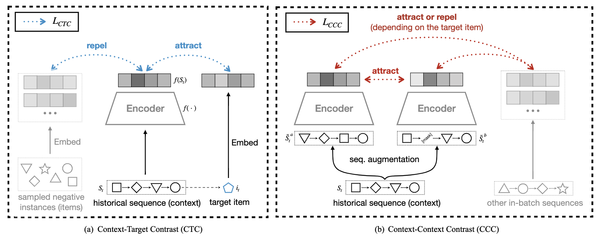

# ContraRec



This is our public implementation for the paper:

*Chenyang Wang, Weizhi Ma, Chong Chen, Min Zhang, Yiqun Liu, and Shaoping Ma. [Sequential Recommendation with Multiple Contrast Signals](https://dl.acm.org/doi/pdf/10.1145/3522673). In TOIS'22.*

### Getting Started

1. Install [Anaconda](https://docs.conda.io/en/latest/miniconda.html) with Python >= 3.5
2. Clone the repository and install requirements

```bash
git clone -b TOIS22 https://github.com/THUwangcy/ReChorus.git
```

3. Install requirements and step into the `src` folder

```bash
cd ReChorus
pip install -r requirements.txt
cd src
```

4. Run model on the build-in dataset

```bash
python main.py --model_name ContraRec --emb_size 64 --lr 1e-4 --l2 1e-6 --history_max 20 --encoder BERT4Rec --gamma 1 --temp 0.2 --batch_size 4096 --dataset 'Grocery_and_Gourmet_Food'
```

The main arguments of ContraRec are listed below.

| Args        | Default  | Help                                                         |
| ----------- | -------- | ------------------------------------------------------------ |
| emb_size    | 64       | Size of embedding vectors                                    |
| gamma       | 1        | Coefficient of the CCC loss                                  |
| ctc_temp    | 1        | Temperature in the CTC loss                                  |
| ccc_temp    | 0.2      | Temperature in the CCC loss                                  |
| num_neg     | 1        | Number of negative items in CTC                              |
| encoder     | BERT4Rec | Sequence encoder: GRU4Rec / Caser / BERT4Rec                 |
| batch_size  | 256      | Batch size                                                   |
| history_max | 20       | Maximum length of history to consider                        |
| lr          | 1e-3     | Learning rate                                                |
| l2          | 0        | Weight decay of the optimizer                                |
| regenerate  | 0        | Whether to read data again and regenerate intermediate files |
| num_workers | 5        | Number of processors when preparing batches                  |

## Performance

We use the public [Amazon dataset](http://jmcauley.ucsd.edu/data/amazon/links.html) (*Grocery_and_Gourmet_Food* category, 5-core version) as our build-in datasets. Other datasets in the paper can be generated by the jupyter notebook in the data folder. Corresponding commands on all the datasets are listed in [run.sh](https://github.com/THUwangcy/ReChorus/tree/TOIS22/src/run.sh).

The table below lists the results of these models in `Grocery_and_Gourmet_Food` dataset (145.8k entries). Leave-one-out is applied to split data: the most recent interaction of each user for testing, the second recent item for validation, and the remaining items for training. We randomly sample 99 negative items for each test case to rank together with the ground-truth item. 

| Model                                                                                             | HR@5       | NDCG@5     | Time/iter | Sequential |
| ------------------------------------------------------------------------------------------------- | ---------- | ---------- | --------- | ---------- |
| [BPR](https://github.com/THUwangcy/ReChorus/tree/TOIS22/src/models/general/BPR.py)                | 0.3574     | 0.2480     | 2.5s      |            |
| [LightGCN](https://github.com/THUwangcy/ReChorus/tree/TOIS22/src/models/general/LightGCN.py)      | 0.3713     | 0.2577     | 6.1s      |            |
| [FPMC](https://github.com/THUwangcy/ReChorus/tree/TOIS22/src/models/sequential/FPMC.py)           | 0.3618     | 0.2816     | 3.4s      | √          |
| [GRU4Rec](https://github.com/THUwangcy/ReChorus/tree/TOIS22/src/models/sequential/GRU4Rec.py)     | 0.3664     | 0.2597     | 4.9s      | √          |
| [NARM](https://github.com/THUwangcy/ReChorus/tree/TOIS22/src/models/sequential/NARM.py)           | 0.3621     | 0.2586     | 8.2s      | √          |
| [SASRec](https://github.com/THUwangcy/ReChorus/tree/TOIS22/src/models/sequential/SASRec.py)       | 0.3888     | 0.2923     | 7.2s      | √          |
| [ContraRec](https://github.com/THUwangcy/ReChorus/tree/TOIS22/src/models/sequential/ContraRec.py) | **0.4269** | **0.3290** | 5.6s      | √          |

## Citation

```
@article{wang2022sequential,
  title={Sequential Recommendation with Multiple Contrast Signals},
  author={Wang, Chenyang and Ma, Weizhi and Chen, Chong},
  journal={ACM Transactions on Information Systems (TOIS)},
  year={2022},
  publisher={ACM New York, NY}
}
```


## Contact

Chenyang Wang (THUwangcy@gmail.com)

<!-- MARKDOWN LINKS & IMAGES -->

<!-- https://www.markdownguide.org/basic-syntax/#reference-style-links -->

[contributors-shield]: https://img.shields.io/github/contributors/othneildrew/Best-README-Template.svg?style=flat-square
[contributors-url]: https://github.com/othneildrew/Best-README-Template/graphs/contributors
[forks-shield]: https://img.shields.io/github/forks/othneildrew/Best-README-Template.svg?style=flat-square
[forks-url]: https://github.com/othneildrew/Best-README-Template/network/members
[stars-shield]: https://img.shields.io/github/stars/othneildrew/Best-README-Template.svg?style=flat-square
[stars-url]: https://github.com/othneildrew/Best-README-Template/stargazers
[issues-shield]: https://img.shields.io/github/issues/othneildrew/Best-README-Template.svg?style=flat-square
[issues-url]: https://github.com/othneildrew/Best-README-Template/issues
[license-shield]: https://img.shields.io/github/license/othneildrew/Best-README-Template.svg?style=flat-square
[license-url]: https://github.com/othneildrew/Best-README-Template/blob/master/LICENSE.txt
[linkedin-shield]: https://img.shields.io/badge/-LinkedIn-black.svg?style=flat-square&logo=linkedin&colorB=555
[linkedin-url]: https://linkedin.com/in/othneildrew
[product-screenshot]: images/screenshot.png
