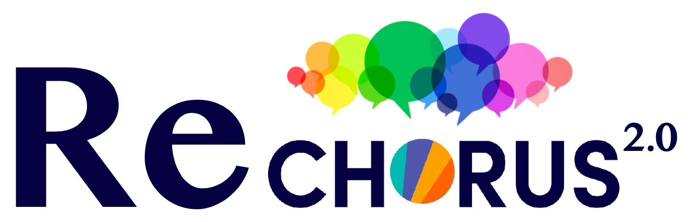
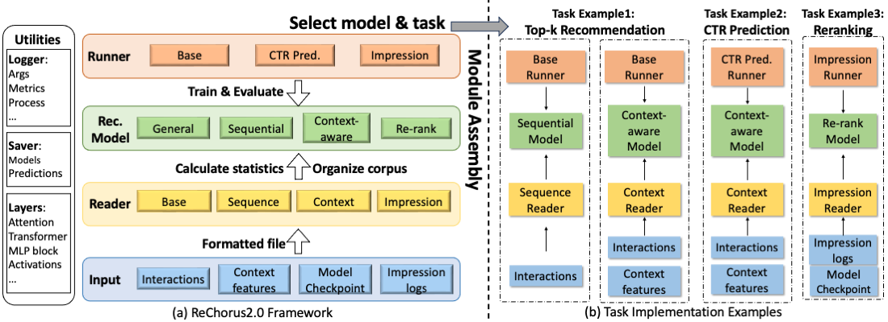

---

[](./LICENSE)


ReChorus2.0 is a modular and task-flexible PyTorch library for recommendation, especially for research purpose. It aims to provide researchers a flexible framework to implement various recommendation tasks, compare different algorithms, and adapt to diverse and highly-customized data inputs. We hope ReChorus2.0 can serve as a more convinient and user-friendly tool for researchers, so as to form a "Chorus" of recommendation tasks and algorithms.

The previous version of ReChorus can be found at [ReChorus1.0](https://github.com/THUwangcy/ReChorus/tree/ReChorus1.0)
## What's New in ReChorus2.0:

- **New Tasks**: Newly supporting the context-aware top-k recommendation and CTR prediction task. Newly supporting the Impression-based re-ranking task.
- **New Models**: Adding Context-aware Recommenders and Impression-based Re-ranking Models. Listed below.
- **New dataset format**: Supporting various contextual feature input. Customizing candidate item lists in training and evaluation. Supporting variable length positive and negative samples.
- **Task Flexible**: Each model can serve for different tasks, and task switching is conveniently achieved by altering *model mode*.
  

This framework is especially suitable for researchers to choose or implement desired experimental settings, and compare algorithms under the same setting. The characteristics of our framework can be summarized as follows:

- **Modular**: primary functions modularized into distinct components: runner, model, and reader, facilitating code comprehension and integration of new features.
  
- **Swift**: concentrate on your model design ***in a single file*** and implement new models quickly.

- **Efficient**: multi-thread batch preparation, special implementations for the evaluation, and around 90% GPU utilization during training for deep models.

- **Flexible**: implement new readers or runners for different datasets and experimental settings, and each model can be assigned with specific helpers.

## Structure

Generally, ReChorus decomposes the whole process into three modules:

- [Reader](https://github.com/THUwangcy/ReChorus/tree/master/src/helpers/BaseReader.py): read dataset into DataFrame and append necessary information to each instance
- [Runner](https://github.com/THUwangcy/ReChorus/tree/master/src/helpers/BaseRunner.py): control the training process and model evaluation, including evaluation metrics.
- [Model](https://github.com/THUwangcy/ReChorus/tree/master/src/models/BaseModel.py): define how to generate output (predicted labels or ranking scores) and prepare batches.




## Getting Started

1. Install [Anaconda](https://docs.conda.io/en/latest/miniconda.html) with Python >= 3.5
2. Clone the repository

```bash
git clone https://github.com/THUwangcy/ReChorus.git
```

3. Install requirements and step into the `src` folder

```bash
cd ReChorus
pip install -r requirements.txt
cd src
```

4. Run model with the build-in dataset

```bash
python main.py --model_name BPRMF --emb_size 64 --lr 1e-3 --l2 1e-6 --dataset Grocery_and_Gourmet_Food
```

5. (optional) Run jupyter notebook in `dataset` folder to download and build new datasets, or prepare your own datasets according to [Guideline](https://github.com/THUwangcy/ReChorus/tree/master/data/README.md) in `data`

6. (optional) Implement your own models according to [Guideline](https://github.com/THUwangcy/ReChorus/tree/master/src/README.md) in `src`

## Tasks & Settings

The tasks & settings are listed below

<table>
<tr><th> Tasks </th><th> Runner </th><th> Metrics </th><th> Loss Functions</th><th> Reader </th><th> BaseModel </th><th> Models</th><th> Model Modes </th></tr>
<tr><td rowspan="3"> Top-k Recommendation </td><td rowspan="3"> BaseRunner </td><td rowspan="3"> HitRate NDCG </td><td rowspan="3"> BPR </td><td> BaseReader </td><td> BaseModel.GeneralModel </td><td> general </td><td> '' </td></tr>
<tr><td> SeqReader </td><td> BaseModel.SequentialModel </td><td> sequential </td><td> '' </td></tr>
<tr><td> ContextReader </td><td> BaseContextModel.ContextModel </td><td> context </td><td> 'TopK' </td></tr>
<tr><td> CTR Prediction </td><td> CTRRunner </td><td> BPR, BCE </td><td> AUC Logloss </td><td> ContextReader </td><td> BaseContextModel.ContextCTRModel </td><td> context </td><td> 'CTR' </td></tr>
<tr><td rowspan="4"> Impression-based Ranking </td><td rowspan="4"> ImpressionRunner </td><td rowspan="4"> HitRate NDCG MAP </td><td rowspan="4"> List-level BPR, Listnet loss, Softmax cross entropy loss, Attention rank </td><td> ImpressionReader </td><td> BaseImpressionModel.ImpressionModel </td><td> general </td><td> 'Impression' </td></tr>
<tr><td> ImpressionSeqReader </td><td> BaseImpressionModel.ImpressionSeqModel </td><td> sequential </td><td> 'Impression' </td></tr>
<tr><td> ImpressionReader </td><td> BaseRerankerModel.RerankModel </td><td> reranker </td><td> 'General' </td></tr>
<tr><td> ImpressionSeqReader </td><td> BaseRerankerModel.RerankSeqModel </td><td> reranker </td><td> 'Sequential' </td></tr>
</table>


## Arguments

The main arguments are listed below.

| Args            | Default   | Description                |
| --------------- | --------- | -------------------------- |
| model_name      | 'BPRMF'   | The name of the model class.                                            |
| model_mode      | ''        | The task mode for the model to implement.                               |
| lr              | 1e-3      | Learning rate.                                                          |
| l2              | 0         | Weight decay in optimizer.                                              |
| test_all        | 0         | Wheter to rank all the items during evaluation.                         |
| metrics         | 'NDCG,HR' | The list of evaluation metrics (seperated by comma).                    |
| topk            | '5,10,20' | The list of K in evaluation metrics (seperated by comma).               |
| num_workers     | 5         | Number of processes when preparing batches.                             |
| batch_size      | 256       | Batch size during training.                                             |
| eval_batch_size | 256       | Batch size during inference.                                            |
| load            | 0         | Whether to load model checkpoint and continue to train.                 |
| train           | 1         | Wheter to perform model training.                                       |
| regenerate      | 0         | Wheter to regenerate intermediate files.                                |
| random_seed     | 0         | Random seed of everything.                                              |
| gpu             | '0'       | The visible GPU device (pass an empty string '' to only use CPU).       |
| buffer          | 1         | Whether to buffer batches for dev/test.                                 |
| history_max     | 20        | The maximum length of history for sequential models.                    |
| num_neg         | 1         | The number of negative items for each training instance.                |
| test_epoch      | -1        | Print test set metrics every test_epoch during training (-1: no print). |

## Models

We have implemented the following methods (still updating):

**General Recommenders**

- [Bayesian personalized ranking from implicit feedback](https://arxiv.org/pdf/1205.2618.pdf?source=post_page) (BPRMF [UAI'09])
- [Neural Collaborative Filtering](https://arxiv.org/pdf/1708.05031.pdf?source=post_page---------------------------) (NeuMF [WWW'17])
- [Learning over Knowledge-Base Embeddings for Recommendation](https://arxiv.org/pdf/1803.06540.pdf) (CFKG [SIGIR'18])
- [LightGCN: Simplifying and Powering Graph Convolution Network for Recommendation](https://dl.acm.org/doi/abs/10.1145/3397271.3401063?casa_token=mMzWDMq9WxQAAAAA%3AsUQEeXtBSLjctZa7qfyOO25nOBqdHWW8ukbjZUeOmcprZcmF3QBWKBtdICrMDidOy8MJ28n3Z1zy5g) (LightGCN [SIGIR'20])
- [Bootstrapping User and Item Representations for One-Class Collaborative Filtering](https://arxiv.org/pdf/2105.06323) (BUIR [SIGIR'21])
- [Towards Representation Alignment and Uniformity in Collaborative Filtering](https://arxiv.org/pdf/2206.12811.pdf) (DirectAU [KDD'22])

**Sequential Recommenders**

- [Factorizing Personalized Markov Chains for Next-Basket Recommendation](https://dl.acm.org/doi/pdf/10.1145/1772690.1772773?casa_token=hhM2wEArOQEAAAAA:r_vhs7X8VE0rJ7FF5aZ4i-P-z1mSlBABdw5O9p0cuOahTOQ8D3FVyX6_d58sbQFiV1q1vdVHB-wKqw) (FPMC [WWW'10])
- [Session-based Recommendations with Recurrent Neural Networks](https://arxiv.org/pdf/1511.06939) (GRU4Rec [ICLR'16])
- [Neural Attentive Session-based Recommendation](https://arxiv.org/pdf/1711.04725.pdf) (NARM [CIKM'17])
- [Personalized Top-N Sequential Recommendation via Convolutional Sequence Embedding](https://arxiv.org/pdf/1809.07426) (Caser [WSDM'18])
- [Self-attentive Sequential Recommendation](https://arxiv.org/pdf/1808.09781.pdf) (SASRec [IEEE'18])
- [Modeling Item-specific Temporal Dynamics of Repeat Consumption for Recommender Systems](https://dl.acm.org/doi/pdf/10.1145/3308558.3313594) (SLRC [WWW'19])
- [Time Interval Aware Self-Attention for Sequential Recommendation](https://dl.acm.org/doi/pdf/10.1145/3336191.3371786) (TiSASRec [WSDM'20])
- [Make It a Chorus: Knowledge- and Time-aware Item Modeling for Sequential Recommendation](http://www.thuir.cn/group/~mzhang/publications/SIGIR2020Wangcy.pdf) (Chorus [SIGIR'20])
- [Controllable Multi-Interest Framework for Recommendation](https://dl.acm.org/doi/pdf/10.1145/3394486.3403344?casa_token=r35exDCLzSsAAAAA:hbdvRtwvH7LlbllHH7gITV_mpA5hYnAFXcpT2bW8MnbK7Gta50E60xNhC6KoQtY6AGOHaEVsK_GRVQ) (ComiRec [KDD'20])
- [Towards Dynamic User Intention: Temporal Evolutionary Effects of Item Relations in Sequential Recommendation](https://chenchongthu.github.io/files/TOIS-KDA-wcy.pdf) (KDA [TOIS'21])
- [Sequential Recommendation with Multiple Contrast Signals](https://dl.acm.org/doi/pdf/10.1145/3522673) (ContraRec [TOIS'22])
- [Target Interest Distillation for Multi-Interest Recommendation]() (TiMiRec [CIKM'22])

**Context-aware Recommenders**

General Context-aware Recommenders
- [Factorization Machines](https://ieeexplore.ieee.org/document/5694074) (FM [ICDM'10])
- [Wide {\&} Deep Learning for Recommender Systems](https://dl.acm.org/doi/pdf/10.1145/2988450.2988454) (WideDeep [DLRS@Recsys'16])
- [Attentional Factorization Machines: Learning the Weight of Feature Interactions via Attention Networks](https://arxiv.org/pdf/1708.04617) (AFM [IJCAI'17])
- [DeepFM: A Factorization-Machine based Neural Network for CTR Prediction](https://arxiv.org/pdf/1703.04247) (DeepFM [IJCAI'17])
- [Deep & Cross Network for Ad Click Predictions](https://dl.acm.org/doi/pdf/10.1145/3124749.3124754) (DCN [KDD'17])
- [AutoInt: Automatic Feature Interaction Learning via Self-Attentive Neural Networks](https://arxiv.org/pdf/1810.11921) (AutoInt [CIKM'18])
- [xdeepfm: Combining explicit and implicit feature interactions for recommender systems](https://arxiv.org/pdf/1803.05170.pdf%E2%80%8B%E2%80%8B) (xDeepFM [KDD'18])
- [Deep interest evolution network for click-through rate prediction](https://aaai.org/ojs/index.php/AAAI/article/view/4545/4423) (DIEN [AAAI'19])
- [DCN v2: Improved deep & cross network and practical lessons for web-scale learning to rank systems](https://arxiv.org/pdf/2008.13535) (DCNv2 [WWW'21])
- [Looking at CTR Prediction Again: Is Attention All You Need?](https://arxiv.org/pdf/2105.05563) (SAM [SIGIR'21])
- [CAN: feature co-action network for click-through rate prediction](https://dl.acm.org/doi/abs/10.1145/3488560.3498435) (CAN [WSDM'22])
- [FinalMLP: an enhanced two-stream MLP model for CTR prediction](https://ojs.aaai.org/index.php/AAAI/article/download/25577/25349) (FinalMLP [AAAI'23])

Sequential Context-aware Recommenders
- [Deep interest network for click-through rate prediction](https://arxiv.org/pdf/1706.06978) (DIN [KDD'18])
- [End-to-end user behavior retrieval in click-through rateprediction model](https://arxiv.org/pdf/2108.04468) (ETA [CoRR'18])
- [Sampling is all you need on modeling long-term user behaviors for CTR prediction](https://arxiv.org/pdf/2205.10249) (SDIM[CIKM'22])

**Impression-based Re-ranking Models**
- [Personalized Re-ranking for Recommendatio](https://arxiv.org/pdf/1904.06813) (PRM [RecSys'19])
- [SetRank: Learning a Permutation-Invariant Ranking Model for Information Retrieval](https://arxiv.org/pdf/1912.05891) (SIGIR [SIGIR'20])
- [Multi-Level Interaction Reranking with User Behavior History](https://arxiv.org/pdf/2204.09370) (MIR[SIGIR'22])


Experimental results and corresponding configurations are shown in XXX.


## Citation

**If you find ReChorus is helpful to your research, please cite either of the following papers. Thanks!**

```
@inproceedings{to be released,
  title={ReChorus2.0: A Modular and Task-Flexible Recommendation Library},
}

@inproceedings{wang2020make,
  title={Make it a chorus: knowledge-and time-aware item modeling for sequential recommendation},
  author={Wang, Chenyang and Zhang, Min and Ma, Weizhi and Liu, Yiqun and Ma, Shaoping},
  booktitle={Proceedings of the 43rd International ACM SIGIR Conference on Research and Development in Information Retrieval},
  pages={109--118},
  year={2020}
}
@article{王晨阳2021rechorus,
  title={ReChorus: 一个综合, 高效, 易扩展的轻量级推荐算法框架},
  author={王晨阳 and 任一 and 马为之 and 张敏 and 刘奕群 and 马少平},
  journal={软件学报},
  volume={33},
  number={4},
  pages={0--0},
  year={2021}
}
```

This is also our public implementation for the following papers (codes and datasets to reproduce the results can be found at corresponding branch):


- *Chenyang Wang, Min Zhang, Weizhi Ma, Yiqun Liu, and Shaoping Ma. [Make It a Chorus: Knowledge- and Time-aware Item Modeling for Sequential Recommendation](http://www.thuir.cn/group/~mzhang/publications/SIGIR2020Wangcy.pdf). In SIGIR'20.*

```bash
git clone -b SIGIR20 https://github.com/THUwangcy/ReChorus.git
```

- *Chenyang Wang, Weizhi Ma, Min Zhang, Chong Chen, Yiqun Liu, and Shaoping Ma. [Towards Dynamic User Intention: Temporal Evolutionary Effects of Item Relations in Sequential Recommendation](https://chenchongthu.github.io/files/TOIS-KDA-wcy.pdf). In TOIS'21.*

```bash
git clone -b TOIS21 https://github.com/THUwangcy/ReChorus.git
```

- *Chenyang Wang, Weizhi Ma, Chong, Chen, Min Zhang, Yiqun Liu, and Shaoping Ma. [Sequential Recommendation with Multiple Contrast Signals](https://dl.acm.org/doi/pdf/10.1145/3522673). In TOIS'22.*

```bash
git clone -b TOIS22 https://github.com/THUwangcy/ReChorus.git
```

- *Chenyang Wang, Zhefan Wang, Yankai Liu, Yang Ge, Weizhi Ma, Min Zhang, Yiqun Liu, Junlan Feng, Chao Deng, and Shaoping Ma. [Target Interest Distillation for Multi-Interest Recommendation](). In CIKM'22.*

```bash
git clone -b CIKM22 https://github.com/THUwangcy/ReChorus.git
```

## Contact

**ReChorus 1.0**: Chenyang Wang (THUwangcy@gmail.com)

**ReChorus 2.0**: Jiayu Li (lijiayu997@gmail.com), Hanyu Li (l-hy12@outlook.com)

<!-- MARKDOWN LINKS & IMAGES -->

<!-- https://www.markdownguide.org/basic-syntax/#reference-style-links -->

[contributors-shield]: https://img.shields.io/github/contributors/othneildrew/Best-README-Template.svg?style=flat-square
[contributors-url]: https://github.com/othneildrew/Best-README-Template/graphs/contributors
[forks-shield]: https://img.shields.io/github/forks/othneildrew/Best-README-Template.svg?style=flat-square
[forks-url]: https://github.com/othneildrew/Best-README-Template/network/members
[stars-shield]: https://img.shields.io/github/stars/othneildrew/Best-README-Template.svg?style=flat-square
[stars-url]: https://github.com/othneildrew/Best-README-Template/stargazers
[issues-shield]: https://img.shields.io/github/issues/othneildrew/Best-README-Template.svg?style=flat-square
[issues-url]: https://github.com/othneildrew/Best-README-Template/issues
[license-shield]: https://img.shields.io/github/license/othneildrew/Best-README-Template.svg?style=flat-square
[license-url]: https://github.com/othneildrew/Best-README-Template/blob/master/LICENSE.txt
[linkedin-shield]: https://img.shields.io/badge/-LinkedIn-black.svg?style=flat-square&logo=linkedin&colorB=555
[linkedin-url]: https://linkedin.com/in/othneildrew
[product-screenshot]: images/screenshot.png
