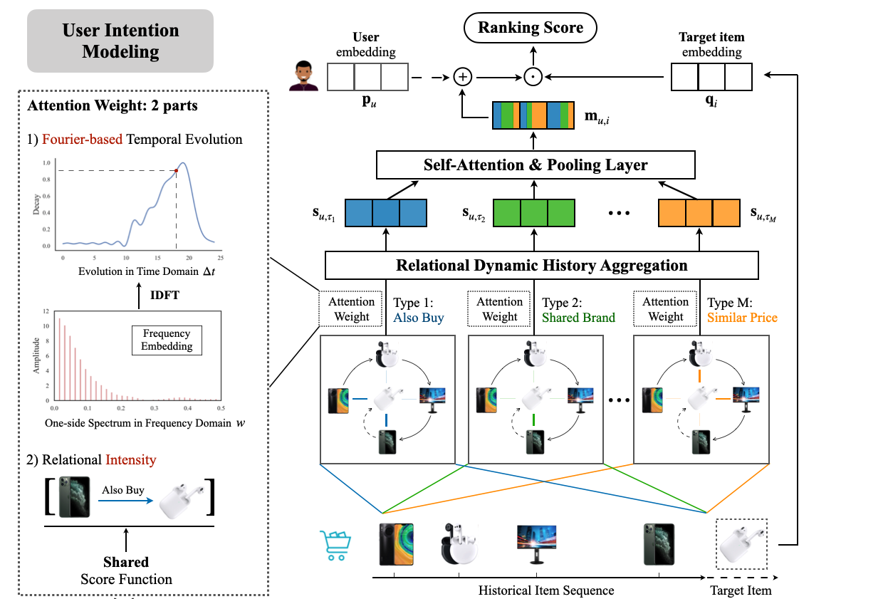

# TiMiRec



This is our public implementation for the paper:

*Chenyang Wang, Zhefan Wang, Yankai Liu, Yang Ge, Weizhi Ma, Min Zhang, Yiqun Liu, Junlan Feng, Chao Deng, and Shaoping Ma. [Target-Interest Distillation for Multi-Interest Recommendation](). In CIKM'22.*

### Getting Started

1. Install [Anaconda](https://docs.conda.io/en/latest/miniconda.html) with Python >= 3.5
2. Clone the repository and install requirements

```bash
git clone -b CIKM22 https://github.com/THUwangcy/ReChorus.git
```

3. Install requirements and step into the `src` folder

```bash
cd ReChorus
pip install -r requirements.txt
cd src
```

4. Run model on the build-in dataset

```bash
# 1. pretrain multi-interest extractor
python main.py --model_name TiMiRec --dataset ml-1m \
               --lr 1e-4 --l2 1e-6 --history_max 20 \
               --K 2 --add_pos 1 --add_trm 1 --stage pretrain

# 2. joint fintune
python main.py --model_name TiMiRec --dataset ml-1m \
               --lr 1e-4 --l2 1e-6 --history_max 20 \
               --K 2 --add_pos 1 --add_trm 1 --stage finetune \
               --check_epoch 10 --temp 0.5 --n_layers 2
```

The main arguments of TiMiRec are listed below.

| Args        | Default  | Help                                                         |
| ----------- | -------- | ------------------------------------------------------------ |
| emb_size    | 64       | Size of embedding vectors                                    |
| K           | 2        | Number of user interests                                     |
| add_pos     | 1        | Whether to add the position embedding (0/1)                  |
| add_trm     | 1        | Whether to add the transformer layer (0/1)                   |
| stage       | finetune | Training stage: pretrain / finetune                          |
| temp        | 1        | Temperature of the distillation loss                         |
| n_layers    | 1        | Number of MLP layers to derive the interest distribution     |
| batch_size  | 256      | Batch size                                                   |
| history_max | 20       | Maximum length of history to consider                        |
| lr          | 1e-3     | Learning rate                                                |
| l2          | 0        | Weight decay of the optimizer                                |
| regenerate  | 0        | Whether to read data again and regenerate intermediate files |

Commands to reproduce the results can be found in [run.sh](https://github.com/THUwangcy/ReChorus/blob/CIKM22/src/run.sh).

## Citation

```
TBD
```

## Contact

Chenyang Wang ([THUwangcy@gmail.com](mailto:THUwangcy@gmail.com))
