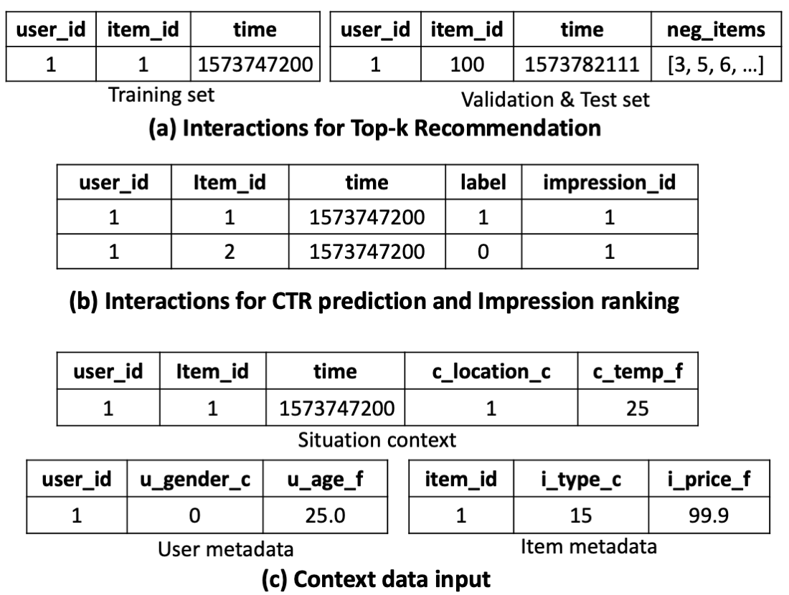

# Dataset

We include the public [Amazon dataset](http://jmcauley.ucsd.edu/data/amazon/links.html) (*Grocery_and_Gourmet_Food* category, 5-core version with metadata), [MIND-Large dataset](https://msnews.github.io/), and [MovieLens-1M](https://grouplens.org/datasets/movielens/) as our built-in datasets.
The pre-processed version of Amazon dataset can be found in the `./Grocery_and_Gourmet_Food` dir, which supports Top-k recommendation tasks.
You can also download and process MIND and MovieLens datasets for CTR prediction, Top-k recommendation, and re-ranking tasks in the corresponding notebooks in `MIND_Large` and `MovieLens_1M` datasets.

Our framework can also work with other datasets easily. We describe the required file formats for each task and the format for context information below:

## Top-k Recommendation Task

**train.csv**
- Format: `user_id \t item_id \t time`
- All ids **begin from 1** (0 is reserved for NaN), and the followings are the same.
- Need to be sorted in **time-ascending order** when running sequential models.

**test.csv & dev.csv**

- Format: `user_id \t item_id \t time \t neg_items`
- The last column is the list of negative items corresponding to each ground-truth item (should not include unseen item ids beyond the `item_id` column in train/dev/test sets).
- The number of negative items need to be the same for a specific set, but it can be different between dev and test sets.
- If there is no `neg_items` column, the evaluation will be performed over all the items by default.

## CTR Prediction Task

**train.csv & test.csv & dev.csv**
- Format: `user_id \t item_id \t time \t label`
- Labels should be 0 or 1 to indicate the item is clicked or not.
- Need to be sorted in **time-ascending order** when running sequential models.

## Impression-based Ranking/Reranking Task

**train.csv & test.csv & dev.csv**
- Format: `user_id \t item_id \t time \t label \t impression_id`
- All interactions with the same impression id will be grouped as a candidate list for training and evaluations.
- If there is no `impression_id` column, interactions will grouped by `time`.
- Labels should be 0 or 1 to indicate the item is clicked or not.
- Need to be sorted in **time-ascending order** when running sequential models.

## Context Information

**item_meta.csv** (optional)

- Format: `item_id \t i_<attribute>_<format> \t ... \t r_<relation> \t ...`
- Optional, only needed for context-aware models and some of the knowledge-aware models (CFKG, SLRC+, Chorus, KDA).
- For context-aware models, an argument called `include_item_features` is used to control whether to use the item metadata or not.
- `i_<attribute>_<format>` is the attribute of an item, such as category, brand, price, and so on. The features should be numerical. The header should start with `i_` and the <format> is set to `c` for categorical features and `f` for dense (float) features.
- `r_<relation>` is the relations between items, and its value is a list of items (can be empty []). Assume `item_id` is `i`, if `j` appears in `r_<relation>`, then `(i, relation, j)` holds in the knowledge graph. Note that the corresponding header here must start with "r_" to be distinguished from attributes.

**user_meta.csv** (optional)

- Format: `user_id \t u_<attribute>_<format> \t ...`
- Optional, only needed for context-aware models, where an argument called `include_user_features` is used to control whether to use the user metadata or not.
- `u_<attribute>_<format>` is the attribute of a user, such as gender, age, and so on. The header should start with `u_` and the <format> is set to `c` for categorical features and `f` for dense (float) features.

**situation metadata** (optional)
- Situation features are appended to each line of interaction in **train.csv & test.csv & dev.csv**
- Format: `user_id \t item_id \t time \t ... \t c_<attribute>_<format> \t ...`
- Optional, only needed for context-aware models, where an argument called `include_situation_features` is used to control whether to use the sitaution metadata or not.
- `c_<attribute>_<format>` is the attribute of a situation, such as day of week, hour of day, activity type, and so on. The header should start with `c_` and the <format> is set to `c` for categorical features and `f` for dense (float) features.

↓ Examples of different data formats

