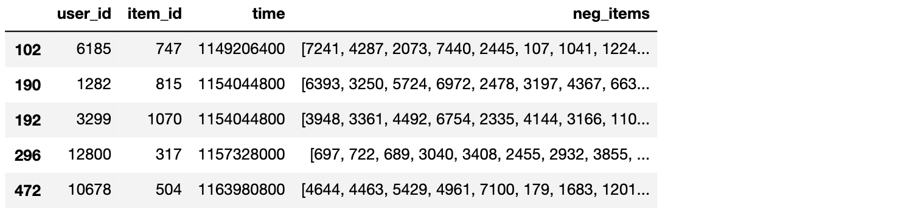
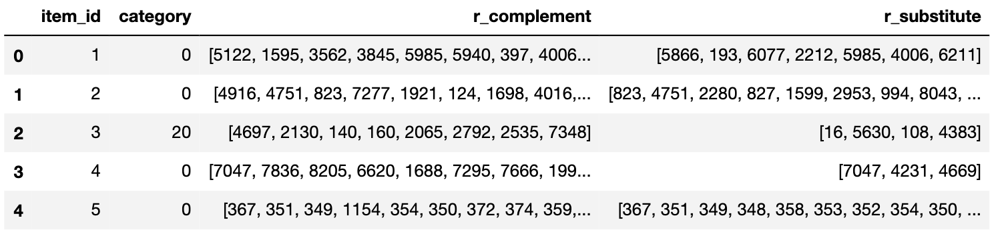

# Dataset

We use the public [Amazon dataset](http://jmcauley.ucsd.edu/data/amazon/links.html) (*Grocery_and_Gourmet_Food* category, 5-core version with metadata) and [MovieLens-1M](https://grouplens.org/datasets/movielens/) as our build-in datasets. You can modify the `DATASET` variable in `Amazon.ipynb` to download and build Amazon datasets for other categories. And the MovieLens dataset can be generated by `MovieLens.ipynb` (supporting both 100K and 1M version).

Our framework can also work with other datasets easily. Some datasets that cater to our format after preprocessing are listed here (updating):

* RecSys2017: [Tsinghua Cloud](https://cloud.tsinghua.edu.cn/d/2b7cb1b730c84f1ea12e/), [Google Drive](https://drive.google.com/drive/folders/1rhUQwTYVai4kt54GAjdFUU4CVryNPwC9?usp=sharing), [Baidu Netdisk](https://pan.baidu.com/s/1lNJGciX_BrtzhgLN6RMH_w) (yat9)

We describe the required files below (recommend to open `Amazon.ipynb` or `MovieLens.ipynb` to observe the format of dataset files):

**train.csv**

- Format: `user_id \t item_id \t time`
- All ids **begin from 1** (0 is reserved for NaN), and the followings are the same.
- Need to be sorted in **time-ascending order** when running sequential models.

**test.csv & dev.csv**

- Format: `user_id \t item_id \t time \t neg_items`
- The last column is the list of negative items corresponding to each ground-truth item (should not include unseen item ids beyond the `item_id` column in train/dev/test sets).
- The number of negative items need to be the same for a specific set, but it can be different between dev and test sets.
- If there is no `neg_items` column, the evaluation will be performed over all the items by default.

**item_meta.csv** (optional)

- Format: `item_id \t i_<attribute> \t ... \t r_<relation> \t ...`
- Optional, only needed for some of the models (CFKG, SLRC+, Chorus, KDA).
- `i_<attribute>` is the attribute of an item, such as category, brand and so on. The header should start with `i_` and the values need to be discrete and finite.
- `r_<relation>` is the relations between items, and its value is a list of items (can be empty []). Assume `item_id` is `i`, if `j` appears in `r_<relation>`, then `(i, relation, j)` holds in the knowledge graph. Note that the corresponding header here must start with "r_" to be distinguished from attributes.

You can also implement a new reader class based on [BaseReader.py](https://github.com/THUwangcy/ReChorus/tree/master/src/helpers/BaseReader.py) and read data in your own style, as long as the basic information is included. Then assign your model with the new reader and begin to use new members of the reader when preparing batches in the model.

