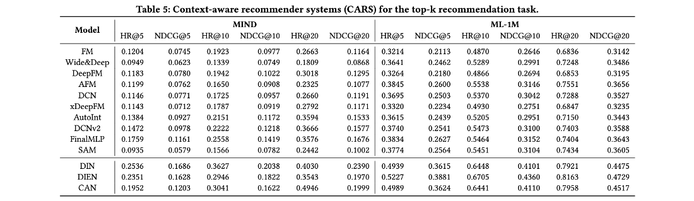
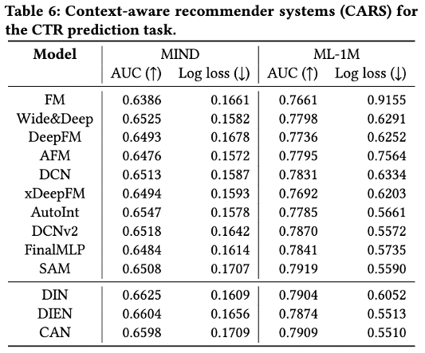

# Demo Scripts and Results

The demo scripts and corresponding results are provided in this directory.

## Impression-based Ranking and Reranking 

The results of general, sequential, and reranking models in `MovieLens-1M` and `MIND-Large` datasets.
Training, validation, and test sets are split along the global timeline: In MIND, the first six days are treated as training set, followed by half-day validation set and half-day test set; In MovieLens-1M, training, validation, and test sets are split with 80\%, 10\%, 10\% of the time.
The detailed preprocessing scripts are shown in [ML-Preprocessing](https://github.com/THUwangcy/ReChorus/tree/master/data/MovieLens_1M/MovieLens-1M.ipynb) and [MIND-Preprocessing](https://github.com/THUwangcy/ReChorus/tree/master/data/MIND_Large/MIND-large.ipynb).

The configurations are shown in `Rerank_ML1M.sh` and `Rerank_MIND.sh`.

## Top-k Recommendation with Context-aware models

The results of context-aware models in `MovieLens-1M` and `MIND-Large` datasets for the Top-k recommendation task.
Training, validation, and test sets are split along the global timeline: In MIND, the first six days are treated as training set, followed by half-day validation set and half-day test set; In MovieLens-1M, training, validation, and test sets are split with 80\%, 10\%, 10\% of the time.
We randomly sample 99 negative items for each test case to rank together with the ground-truth item (also support ranking over all the items with `--test_all 1`).

The configurations are shown in `Topk_ML1M.sh` and `Topk_MIND.sh`.

## CTR Prediction with Context-aware models

The results of context-aware models in `MovieLens-1M` and `MIND-Large` datasets for the CTR prediction task.
Training, validation, and test sets are split along the global timeline: In MIND, the first six days are treated as training set, followed by half-day validation set and half-day test set; In MovieLens-1M, training, validation, and test sets are split with 80\%, 10\%, 10\% of the time.

The configurations are shown in `CTR_ML1M.sh` and `CTR_MIND.sh`.

## Top-k Recommendation on Amazon dataset
> From ReChorus1.0

The results of general and sequential models in `Grocery_and_Gourmet_Food` dataset (151.3k entries). 
Leave-one-out is applied to split data: the most recent interaction of each user for testing, the second recent item for validation, and the remaining items for training. 
We randomly sample 99 negative items for each test case to rank together with the ground-truth item (also support ranking over all the items with `--test_all 1`).

The configurations are shown in `Topk_Amazon.sh`

| Model                                                                                             | HR@5   | NDCG@5 | Time/iter | Sequential | Knowledge | Time-aware |
|:------------------------------------------------------------------------------------------------- |:------:|:------:|:---------:|:----------:|:---------:|:----------:|
| [MostPop](https://github.com/THUwangcy/ReChorus/tree/master/src/models/general/POP.py)            | 0.2065 | 0.1301 | -         |            |           |            |
| [BPRMF](https://github.com/THUwangcy/ReChorus/tree/master/src/models/general/BPRMF.py)              | 0.3549 | 0.2486 | 2.5s      |            |           |            |
| [NeuMF](https://github.com/THUwangcy/ReChorus/tree/master/src/models/general/NCF.py)              | 0.3237 | 0.2221 | 3.4s      |            |           |            |
| [LightGCN](https://github.com/THUwangcy/ReChorus/tree/master/src/models/general/LightGCN.py)      | 0.3705 | 0.2564 | 6.1s      |            |           |            |
| [BUIR](https://github.com/THUwangcy/ReChorus/tree/master/src/models/general/BUIR.py)              | 0.3701 | 0.2567 | 3.3s      |            |           |            |
| [DirectAU](https://github.com/THUwangcy/ReChorus/tree/master/src/models/general/DirectAU.py)      | 0.3911 | 0.2779 | 3.3s      |            |           |            |
| [FPMC](https://github.com/THUwangcy/ReChorus/tree/master/src/models/sequential/FPMC.py)           | 0.3594 | 0.2785 | 3.4s      | √          |           |            |
| [GRU4Rec](https://github.com/THUwangcy/ReChorus/tree/master/src/models/sequential/GRU4Rec.py)     | 0.3659 | 0.2614 | 4.9s      | √          |           |            |
| [NARM](https://github.com/THUwangcy/ReChorus/tree/master/src/models/sequential/NARM.py)           | 0.3650 | 0.2617 | 7.5s      | √          |           |            |
| [Caser](https://github.com/THUwangcy/ReChorus/tree/master/src/models/sequential/Caser.py)         | 0.3526 | 0.2499 | 7.8s      | √          |           |            |
| [SASRec](https://github.com/THUwangcy/ReChorus/tree/master/src/models/sequential/SASRec.py)       | 0.3917 | 0.2942 | 5.5s      | √          |           |            |
| [ComiRec](https://github.com/THUwangcy/ReChorus/tree/master/src/models/sequential/ComiRec.py)     | 0.3753 | 0.2675 | 4.5s      | √          |           |            |
| [TiMiRec+](https://github.com/THUwangcy/ReChorus/tree/master/src/models/sequential/TiMiRec.py)    | 0.4020 | 0.3016 | 8.8s      | √          |           |            |
| [ContraRec](https://github.com/THUwangcy/ReChorus/tree/master/src/models/sequential/ContraRec.py) | 0.4251 | 0.3285 | 5.6s      | √          |           |            |
| [TiSASRec](https://github.com/THUwangcy/ReChorus/tree/master/src/models/sequential/TiSASRec.py)   | 0.3949 | 0.2945 | 7.6s      | √          |           | √          |
| [CFKG](https://github.com/THUwangcy/ReChorus/tree/master/src/models/general/CFKG.py)              | 0.4199 | 0.2984 | 8.7s      |            | √         |            |
| [SLRC+](https://github.com/THUwangcy/ReChorus/tree/master/src/models/sequential/SLRCPlus.py)      | 0.4376 | 0.3263 | 4.3s      | √          | √         | √          |
| [Chorus](https://github.com/THUwangcy/ReChorus/tree/master/src/models/sequential/Chorus.py)       | 0.4668 | 0.3414 | 4.9s      | √          | √         | √          |
| [KDA](https://github.com/THUwangcy/ReChorus/tree/master/src/models/sequential/KDA.py)             | 0.5191 | 0.3901 | 9.9s      | √          | √         | √          |
| [ContraKDA](https://github.com/THUwangcy/ReChorus/tree/master/src/models/sequential/ContraKDA.py) | 0.5282 | 0.3992 | 13.6s     | √          | √         | √          |

